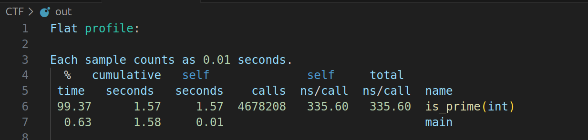
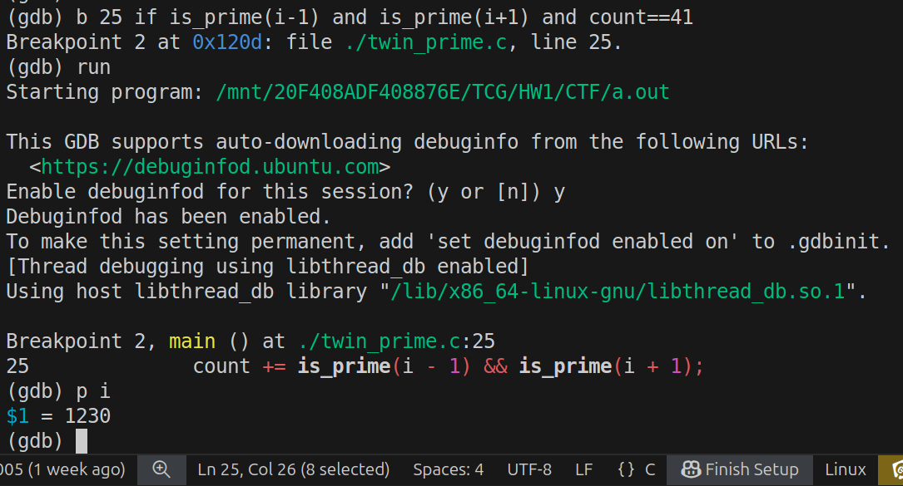
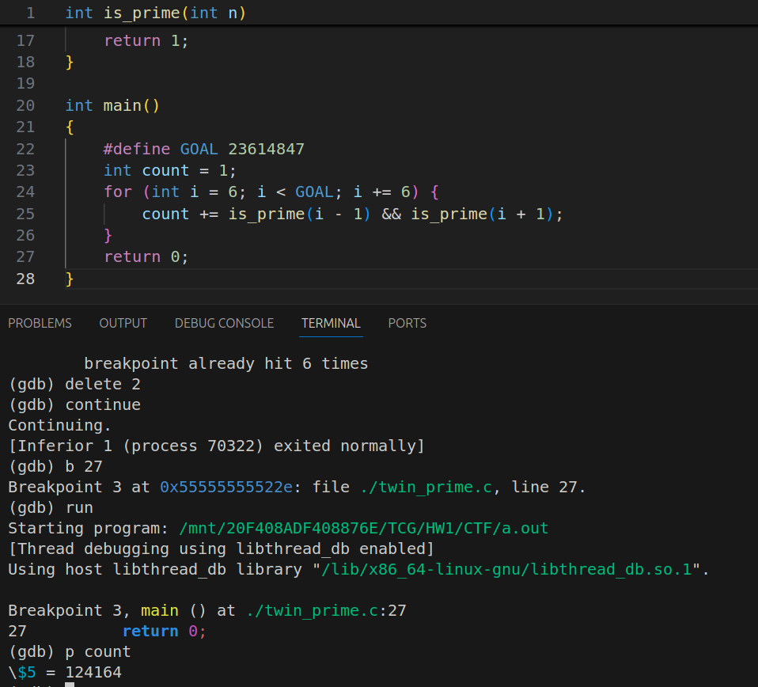

## EX1: CTF

### task 1.

is_prime is totally called $4678208$ times.

### task 2.

The $42^{th}$ pair of twin prime is $1229$ and $1231$.

#### task 3.

The number of  pairs of positive twin primes below 23614847 is 124164.
